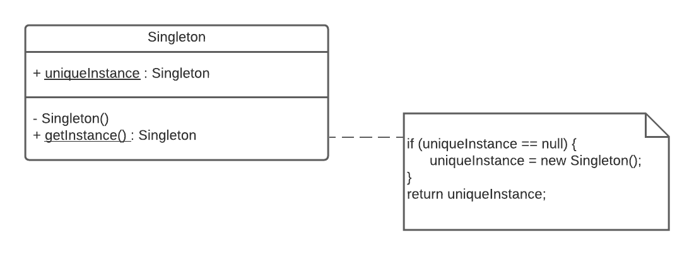
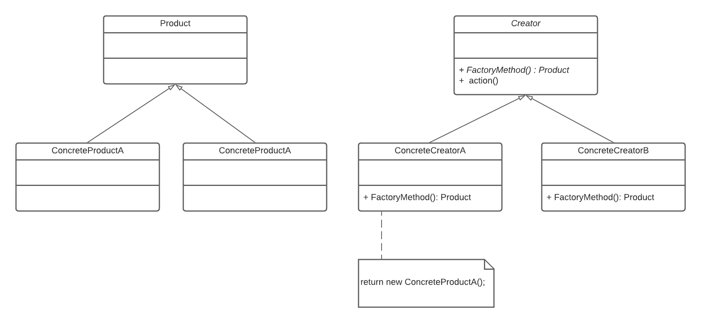
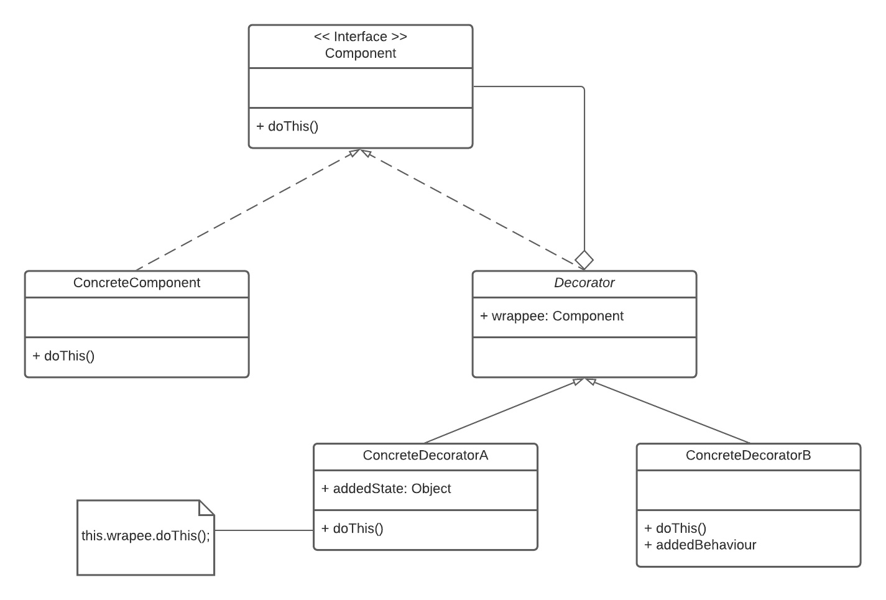
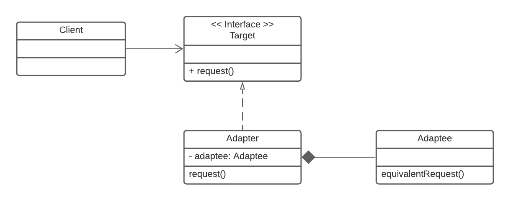
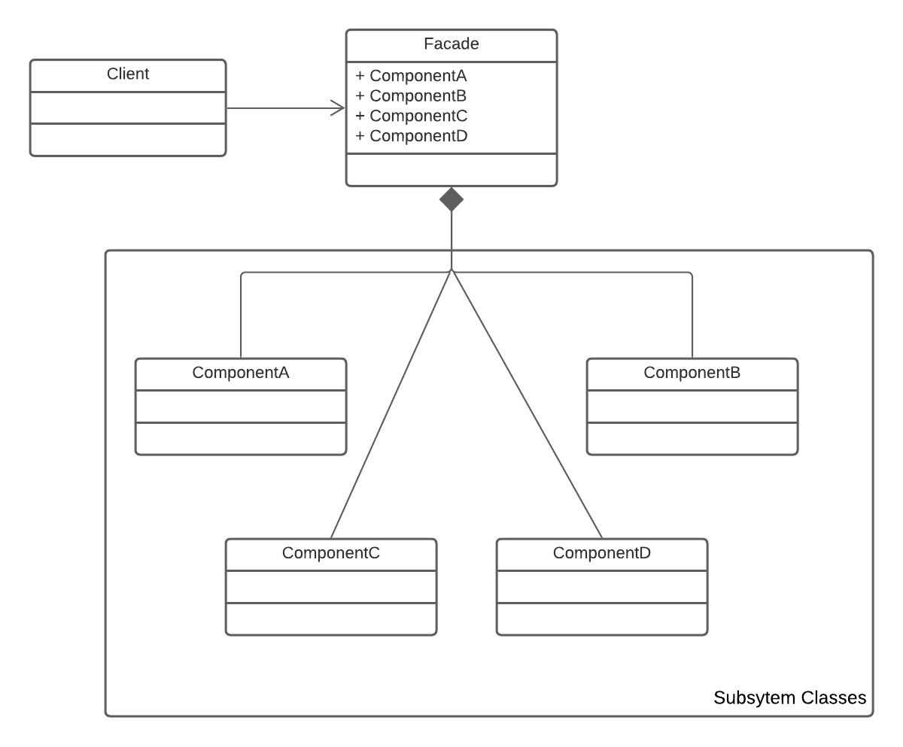
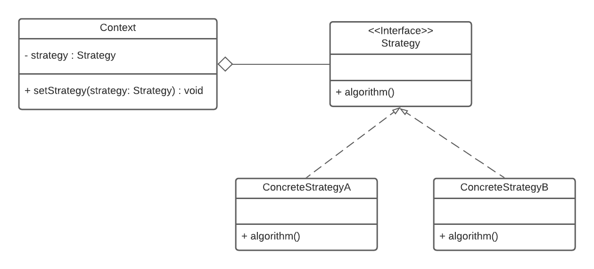
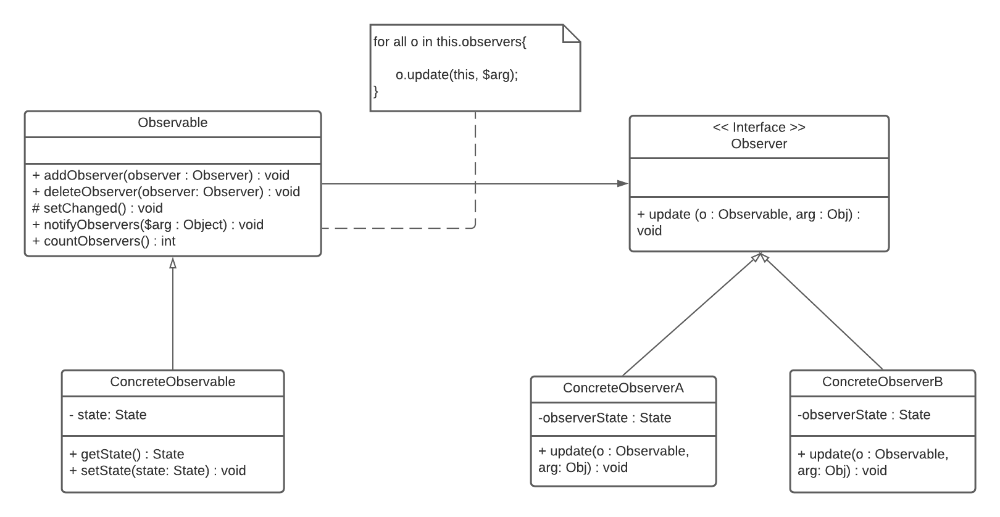
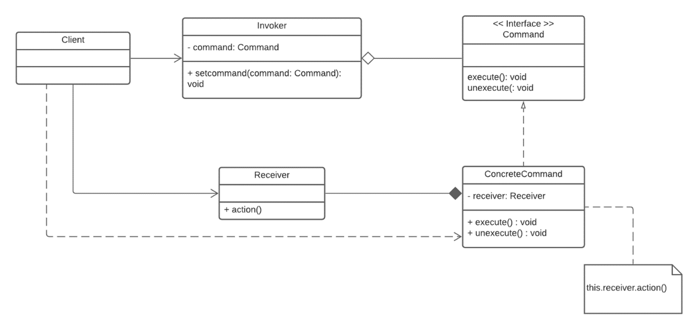
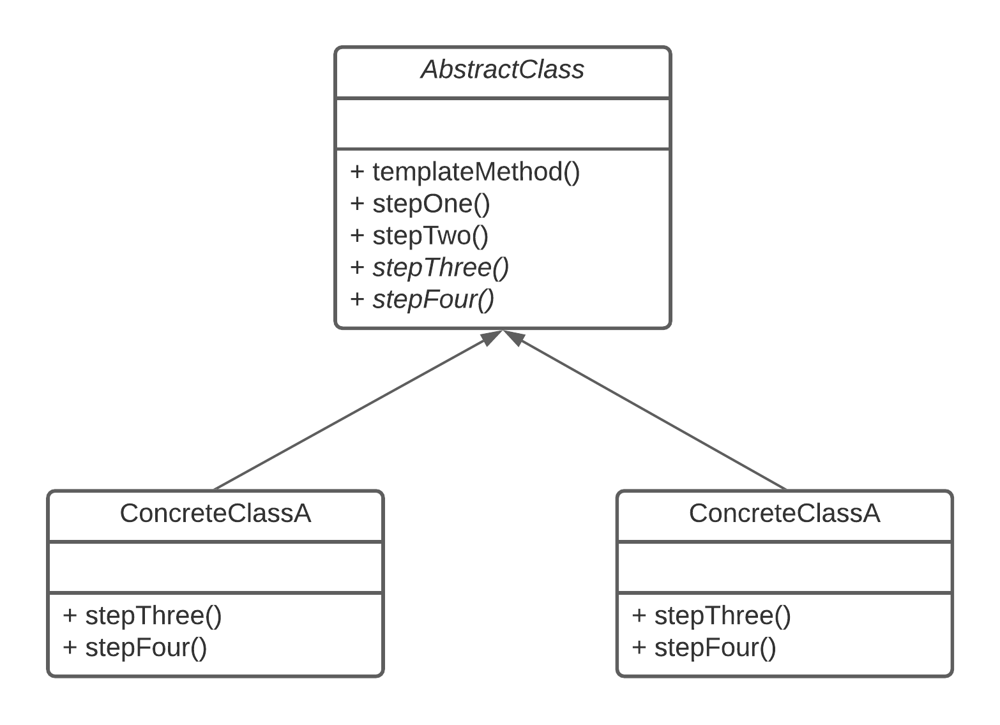
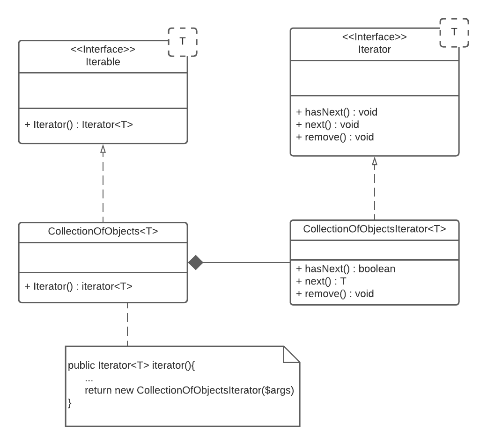

- [Creational Patterns](#creational-patterns)
  - [Singleton Pattern](#singleton-pattern)
    - [Example: Chocolate Boiler](#example-chocolate-boiler)
  - [Factory Pattern](#factory-pattern)
    - [Example: Pizza Stores](#example-pizza-stores)
  - [Builder Pattern](#builder-pattern)
  - [Prototype Pattern](#prototype-pattern)
- [Structural Patterns](#structural-patterns)
  - [Decorator Pattern](#decorator-pattern)
    - [Example: Christmas Tree](#example-christmas-tree)
  - [Adapter Pattern](#adapter-pattern)
    - [Example: Turkey Adapters](#example-turkey-adapters)
  - [Facade Pattern](#facade-pattern)
    - [Example: Home Theatre](#example-home-theatre)
  - [Composite Pattern](#composite-pattern)
  - [Proxy Pattern](#proxy-pattern)
- [Behavioural Patterns](#behavioural-patterns)
  - [Strategy Pattern](#strategy-pattern)
    - [Example: Travelling](#example-travelling)
  - [Observer Pattern](#observer-pattern)
    - [Example: Auction](#example-auction)
  - [Command Pattern](#command-pattern)
    - [Example: Global Remote Control](#example-global-remote-control)
  - [Template Method Pattern](#template-method-pattern)
    - [Example: Hot Beverages](#example-hot-beverages)
  - [Iterator Pattern](#iterator-pattern)
    - [Example: Song Iterator](#example-song-iterator)
  - [State Pattern](#state-pattern)
  - [Visitor Pattern](#visitor-pattern)

# Creational Patterns

## Singleton Pattern

Ensures a class has only one instance of an object and provides a global point of access. We are letting the class manage a single instance of itself.



### Example: Chocolate Boiler

The trick with Singleton is to block external creation of the class:
- Declare a private constructor so that only the class can create an instance of itself.
- Declare a `getInstance()` method as the only point of access.  Whether the unique instance
  exists or not, this is the only way another class can access it.
- Keep a reference to the unique instance in a private class variable.

```java
/**
 * A class for a chocolate boiler in a factory with a single boiler.
 *
 * If more than one boiler is instantiated in a program, bad things can happen.  (e.g. the
 * program creates two boiler instances and fills up an full boiler -> overflow!)
 */
public class ChocolateBoiler {

  private boolean isEmpty;
  private boolean isBoiled;
  private static ChocolateBoiler uniqueInstance;

  /**
   * Private constructor that creates an empty, non-boiled chocolate boiler.
   */
  private ChocolateBoiler(){
    this.isEmpty = false;
    this.isBoiled = false;
  }

  /**
   * A method for accessing the chocolate boiler.  If no boiler has been instantiated, the
   * private constructor is called to create a new one first, then the boiler is returned.
   * Else it just returns the unique boiler.
   *
   * @return the unique instance of the class, i.e. ChocolateBoiler.uniqueInstance
   */
  public static ChocolateBoiler getInstance(){
    if(uniqueInstance == null){
      uniqueInstance = new ChocolateBoiler();
    }
    return uniqueInstance;
  }

  // Other useful methods...
}
```

## Factory Pattern

Defines an abstract class for creating an object, but allows subclasses to decide what objects to instantiate.  It lets a class defer instantiation to subclasses.



The Creator class gives you an interface with a method for creating objects, also known as the factory method.

Any other methods implemented in the abstract Creator class are written to operate on products produced, except the factory method – the creator class is written without knowledge of the actual products that will be created.

### Example: Pizza Stores

We begin with the abstract `Product` class that all the concrete products will inherit from.  
This abstract product class will provide some defaults while the concrete products will define the details  - this part is nothing fancy, just inheritance in its purest form.

We can think of these `Product` classes as the tiny factories that the store call on to make their pizzas.

```java
// Abstract 'Product' class
public class Pizza {

  String crust;
  String type;
  ArrayList<String> ingredients;

  public Pizza(String crust, String type, ArrayList<String> ingredients){
    this.crust = crust;
    this.type = type;
    this.ingredients = ingredients;
  }

  public void prepare(){
    String info = "Preparing a " + this.type + " pizza with " +
            this.crust + " crust";

    for(String ingredient : this.ingredients){
      info += " and " + ingredient;
    }

    System.out.println(info);
  }

  public void bake(){
    System.out.println("Baking pizza...");
  }

  public void box(){ System.out.println("Boxing pizza..."); }

}

// Concrete product classes
public class NYPepperoniPizza extends Pizza {

  public NYPepperoniPizza(){
    super("thin", "pepperoni", new ArrayList<String>());
    this.ingredients.add("cheese");
    this.ingredients.add("pepperoni");
    this.ingredients.add("oregano");
  }
}

public class ChicagoPepperoniPizza extends Pizza{

  public ChicagoPepperoniPizza(){
    super("thick", "pepperoni", new ArrayList<String>());
    this.ingredients.add("cheese");
    this.ingredients.add("pepperoni");
    this.ingredients.add("oil");
  }
}
```

Now we are going to define the `PizzaStore` classes which will encapsulate the creation of the pizzas through the factories we defined above.  We start off with a basic `PizzaStore` abstract class that defines the common methods amongst store franchises - such as the flow of preparing an order - and an abstract factory method.

```java
public abstract class PizzaStore {

  public Pizza orderPizza(String type){
    Pizza pizza = this.makePizza(type);

    pizza.prepare();
    pizza.bake();
    pizza.box();

    return pizza;
  }

  public abstract Pizza makePizza(String type);
}
```

A cheese pizza in Chicago is different from a cheese Pizza in NYC.  However, it is the store in each city that worries about making the right one, not the client ordering the pizza!

The concrete creators decide which concrete product class to instantiate.

```java
public class NYPizzaStore extends PizzaStore{

    @Override
    public Pizza factoryMethod(String type) {
        return switch (type) {
            case "pepperoni" -> new NYPepperoniPizza();
            default -> new NYCheesePizza();
        };
    }
}

public class ChicagoPizzaStore extends PizzaStore {

  @Override
  public Pizza factoryMethod(String type) {
    return switch (type) {
      case "pepperoni" -> new ChicagoPepperoniPizza();
      default -> new ChicagoCheesePizza();
    };
  }
}
```

As it should, the client only deals with the stores and has no knowledge of the intricacies behind creating the right pizza.  The creation of the `Product` is completely encapsulated by the `Creator`.

```java
public class Client {

    public static void main(String[] args) {
        PizzaStore nyc = new NYPizzaStore();
        PizzaStore chi = new ChicagoPizzaStore();

        // Harvey's order
        nyc.orderPizza("pepperoni");

        //Jessica's order
        chi.orderPizza("pepperoni");
    }
}
```

```
Preparing a pepperoni pizza with thin crust and cheese and pepperoni and oregano
Baking pizza...
Boxing pizza...

Preparing a pepperoni pizza with thick crust and cheese and pepperoni and oil
Baking pizza...
Boxing pizza...
```

## Builder Pattern

## Prototype Pattern

---

# Structural Patterns

## Decorator Pattern

Attaches additional responsibilities to an object dynamically.  The decorator pattern involves a set of decorating classes that are used to wrap concrete components.  Decorators provide a flexible alternative to subclassing for extending functionality.

By dynamically composing objects, you can add new functionality by writing new "decorating" code rather than changing existing code.



### Example: Christmas Tree

First we define a common interface for both the concrete components and decorators to implement:

```java
public interface ChristmasTree {

    public String decorate();
}
```

Now we define the base classes, i.e. the **basic component class** and the **abstract decorator class** for all the decorators that we will implement.

```java
/**
 * A class for a basic pine christmas tree.
 */
public class PineChristmasTree implements ChristmasTree{

  @Override
  public String decorate(){
    return "Pine christmas tree";
  }
}

/**
 * An abstract class for a tree Decorator requiring that all subclasses implement the 
 * ChristmasTree interface.  A Decorator has a reference to a ChristmasTree object, 
 * which it wraps.
 */
public abstract class Decorator implements ChristmasTree{

  public ChristmasTree wrappee;

  /**
   * Creates a Decorator object that wraps a given ChristmasTree object.
   *
   * @param wrappee The ChristmasTree to be decorated.
   */
  public Decorator(ChristmasTree wrappee){
    this.wrappee = wrappee;
  }
}
```

Now we implement the **concrete decorator classes** which inherit from the abstract `Decorator` class.  They keep a reference to the object they are wrapping so that they can chain method calls down to the basic component class, this component is passed to their constructor.

```java
/**
 * A class for a christmas tree decorator that adds lights to the tree it wraps.
 */
public class TreeLights extends Decorator{

  public TreeLights(ChristmasTree wrappee) {
    super(wrappee);
  }

  @Override
  public String decorate() {
    return this.wrappee.decorate() + " with lights";
  }
}

/**
 * A class for a christmas tree decorator that adds a topper to the tree it wraps.
 */
public class TreeTopper extends Decorator{

    public TreeTopper(ChristmasTree wrappee){
        super(wrappee);
    }

    @Override
    public String decorate(){
        return this.wrappee.decorate() + " with tree topper";
    }
}
```

Decorators are meant to add behaviour to the object they wrap.  So the basic component class gets additional behaviour added to it, not by adding more code into it, but by having the client wrap it in decorators expanding its behaviour.

```java
// Client wraps concrete components with decorator classes
public class TreeClient {

  public static void main(String[] args) {
    ChristmasTree myTree = new TreeTopper(new TreeLights(new PineChristmasTree()));
    ChristmasTree yourTree = new TreeTopper(new PineChristmasTree());

    System.out.println("Let's decorate my tree: " + myTree.decorate());
    System.out.println("Let's decorate your tree: " + yourTree.decorate());
  }
}
```

```
Let's decorate my tree: Pine christmas tree with lights with tree topper
Let's decorate your tree: Pine christmas tree with tree topper
```

## Adapter Pattern

Converts the interface of a class into another interface the client expects.  Adapter lets classes work together that otherwise couldn't, without changing the code in either one of them.



In decorator, we wrapped classes in decorators to give them new responsibilities.  With adapter, we wrap classes in an adapter to make them look like something they're not.

### Example: Turkey Adapters

Suppose you have a program with some ducks.  You're short on `Duck` objects and you'd like to use some `Turkey` objects in their place.  You can't just cast a Turkey as a Duck nor can you alter the vendor's code for the Turkey class. So **we'll write an adapter class that wraps a `Turkey` and translates its implementation in a way that is compatible with the `Duck` interface**.

For now here is the `Duck` interface and one of its concrete implementations:

```java
public interface Duck {
    public void quack();
    public void fly();
}
```

```java
/**
 * A class for a mallard duck that implements the Duck interface.  A duck quacks and flies.
 */
public class MallardDuck implements Duck{

    @Override
    public void quack() {
        System.out.println("Quack!");
    }

    @Override
    public void fly() {
        System.out.println("I'm flying, soaring...");
    }
}
```

Below is the `Turkey` interface and a concrete implementation that we got from the vendor.  Notice that tukeys don't quack, but gobble.  They also can't fly very long distances at once.

```java
public interface Turkey {
    public void gobble();
    public void fly();
}
```

```java
public class WildTurkey implements Turkey{

    @Override
    public void gobble() {
        System.out.println("Gobble, gobble!!");
    }

    @Override
    public void fly() {
        System.out.println("I'm flying for 100 metres...");
    }
}
```

Now we are going to create an `Adapter` class that implements the `Duck` class by taking in a `Turkey` object and implements the required duck methods in terms of turkey methods. This approach of wrapping the adaptee with an altered interface has the added advantage that we can use the adapter with any subclass of the adaptee.

```java
/**
 * A class for an adapter from the Turkey interface to the Duck interface.
 */
public class TurkeyAdapter implements Duck{

    private Turkey turkey;

    /**
     * Creates a new TurkeyAdapter that takes in a Turkey and adapts it to have Duck behaviour.
     * @param turkey Turkey object to be wrapped in the adapter.
     */
    public TurkeyAdapter(Turkey turkey){
        this.turkey = turkey;
    }

    // The quack translation is to call the turkey's gobble method.
    @Override
    public void quack() {
        this.turkey.gobble();
    }

    // Turkeys fly in short spurts.  To map between a Duck's fly() and a Turkey's we must call the
    // the turkey's method fly() five times to make up for it and fly an equivalent distance.
    @Override
    public void fly() {
        for(int i = 0; i < 5; i++ ){
            this.turkey.fly();
        }
    }
}
```

Now notice how the client can freely work with the `Duck` inteface it expects:

```java
public class Client {

    public static void main(String[] args) {

        // Create a Duck object
        Duck realDuck = new MallardDuck();

        // Create a Turkey object wrapped in an adapter
        Duck fakeDuck = new TurkeyAdapter(new WildTurkey());

        // Notice how the client can freely work with the Duck interface it expects
        realDuck.quack();
        fakeDuck.quack();

        realDuck.fly();
        fakeDuck.fly();
    }
}
```

```
Quack!
Gobble, gobble!!
I'm flying for 500 metres...
I'm flying for 100 metres...
I'm flying for 100 metres...
I'm flying for 100 metres...
I'm flying for 100 metres...
I'm flying for 100 metres... 
```

## Facade Pattern

Provies an interface that simplifies and unifies a set of one or more complex classes that belong to a subsytem.  Facades don't encapsulate the subsystem classes; they simply provide a simplfied interface to their combined functionality.



- The **facade still leaves the subsystem classes available** in casse you need their full power.  But if all you need is a straightforward interface, you have the option of using the simplified facade.
- The facade allows you to decouple the client from any one subsystem class.  If any functionality is added to existing classes (or even if new classes are added) you just need to change the code in the facade.

### Example: Home Theatre

Suppose you have a home theatre with a bunch of fancy electronics.  However, the process of getting ready to watch a movie or listen to a CD can be quite complex...and you have to do the same thing everytime!

We can just define a `HomeTheatreFacade` that unifies all the individual classes - projector, lights, popcorn machine, projector, etc - into a simple interface for entertainment.  If you ever need to do fancier stuff, you can still dig deeper into the any particular class in the subsystem.

```java
/**
 * A class for a home theater facade that is composed with a popcorn popper, 
 * projector, screen, dvd player, lights, and and amplifier.
 */
public class HomeTheaterFacade{
  PopcornPopper popper;
  Projector projector;
  Screen screen;
  DVDPlayer dvd;
  TheatreLights lights;
  Amplifier amp;

  // Takes in references to each component in the subsystem
  public HomeTheatre(PopcornPopper popper,
                Projector projector,
                Screen screen,
                DVDPlayer dvd,
                TheatreLights lights,
                Amplifier amp){
      this.popper = popper;
      this.projector = projector;
      this.screen = screen;
      this.dvd = dvd;
      this.lights = lights;
      this.amp = amp;
  }

  // Delegates all the tasks to each component in the subsystem with one single method
  public void watchMovie(String movie){
      this.popper.on();
      this.popper.pop();
      this.projector.on();
      this.screen.down();
      this.dvd.play(movie);
      this.lights.dim(10);
      this.amp.setSurroundSound();
      this.amp.volume(10);
  }

  public void endMovie(){
      this.popper.off();
      this.projector.off();
      this.screen.up();
      this.dvd.eject();
      this.amp.off();
  }
}
```

## Composite Pattern

## Proxy Pattern

---

# Behavioural Patterns

## Strategy Pattern

Defines a family of algorithms, encapsulates each one, and makes them interchangeable.  Strategy enables the client to select the algorithm at runtime; the algorithm varies independently of the clients that use it.



### Example: Travelling

Here we will implement a simple program that takes a person to a given location through different strategies - the person can travel by car or bus.  The Client only interacts with the context as follows:

```java
public class Client {

    public static void main(String[] args) {
         // People who will travel
        Person bob = new Person("Bob", "120 Street 1");
        Person rob = new Person("Rob", "130 Street 2");
        TravelContext context = new TravelContext();

        // The Client creates a specific strategy object and passes it to the context
        CarStrategy useCar = new CarStrategy();
        // The context exposes a setter which lets clients replace the strategy associated with the context at runtime
        context.setStrategy(useCar);

        context.takeTrip(bob, "terminal 1");
        context.takeTrip(rob, "terminal 2");

        // The client can change strategy at any time, through the context, without having to worry about implementation
        BusStrategy useBus = new BusStrategy();

        context.takeTrip(bob, "hilton hotel");
        context.takeTrip(rob, "fairmont hotel");
    }
}
```

```
Bob has travelled by car to terminal 1
Rob has travelled by car to terminal 2

Bob has travelled by car to hilton hotel
Rob has travelled by car to fairmont hotel
```

The context delegates the algorithm to a linked strategy object instead of doing the work itself. The context does not know what type of strategy it uses or how the algorithm is executed, it simply works with an interface.  In this way, the context is decoupled from the specific strategies and work with all strategies that implement a generic interface.

```java
/**
 * A class for a travel context. It exposes a setter method by mean of which the client can pass a chosen strategy and
 * a call to an algorithm to be implemented by all the valid strategies that can be passed.
 */
public class TravelContext {

    private TravelStrategy strategy;

    /**
     * Sets this context's strategy.
     *
     * @param strategy Given strategy to be used (passed by client).
     */
    public void setStrategy(TravelStrategy strategy){
        this.strategy = strategy;
    }


    /**
     * The algorithm to be called on all the interchangeable strategies.
     *
     * @param person Person that will travel.
     * @param location Location to take the Person object to.
     */
    public void takeTrip(Person person, String location){
        this.strategy.travel(person, location);
    }

}
```

This is the generic interface that declares the functionality to be implemented by the corresponding family of algorithms.

```java
public interface TravelStrategy {

    public void travel(Person person, String location);

}
```

These are the concrete implementations of the Strategy interface.  Notice that the details of how each strategy achieves the algorithm are completely hidden from the context or client.

```java
public class CarStrategy implements TravelStrategy{

    @Override
    public void travel(Person person, String location) {
        person.setLocation(location);
        System.out.println(person.getName() + " has travelled by car to " + person.getLocation() + "\n");
    }
}

public class BusStrategy implements TravelStrategy{

  @Override
  public void travel(Person person, String location) {
    person.setLocation(location);
    System.out.println(person.getName() + " has travelled by bus to " + person.getLocation() + "\n");
  }
}
```

## Observer Pattern
Defines a one-to-many dependency between objects so that when one object changes state, all its dependents are notified and updated automatically.



**Pull Communication Method**: The Observable just sends a short message to observers to notify them that something has changed, the observers are responsible for pulling the data they need from the Observer.

**Push Communication Method**: The Observable just sends all information to the observers; the observers decide what to use.

### Example: Auction

This design pattern can be modelled as an auction (Client) with an auctioneer (Observable) and bidders (Observers) getting information about the status of the transaction from the auctioneer.

```java
/**
 * A class for a Bid. A bid has a unique id and an amount.
 */
public class Bid {

    private static int currID = 1;
    public int amount;
    public int id;

    public Bid(int amount){
        this.amount = amount;
        this.id = Bid.currID;
        increaseCurrID();
    }

    private  static void increaseCurrID(){
        Bid.currID++;
    }
}
```

```java
import java.util.ArrayList;
import java.util.Observable;
import java.util.Observer;

/**
 * A class for an auctioneer at an auction.  An auctioneer receives bids,
 * keeps track of the highest bid and notifies all bidders a new higher bid
 * has been placed.  The auctioneer is observed by the bidders.
 */
public class Auctioneer extends Observable {
    ArrayList<Bid> bids; //list of bids received
    int highestBid;

    public Auctioneer(){
        this.bids = new ArrayList<Bid>();
        this.highestBid = 0;
    }


    /**
     * Receives a passed bid.  If the bid is higher than the current highest bid,
     * the highest bid is updated and auctioneers are notified.
     */
    public void receiveBid(Bid bid){
        this.bids.add(bid);
        if (bid.amount > this.highestBid){
            this.highestBid = bid.amount;
            this.setChanged();
            this.notifyObservers("The highest bid is now " + bid.amount + " with ID: " + bid.id);
        }
    }
}

/**
 * A class for a bidder in an auction. A bidder makes bids and receives updates from an
 * Observable that it has been observing.
 */
public class Bidder implements Observer{

  /**
   * Returns a new Bid object with a unique ID for the given amount.
   *
   * @param amount  Amount the bidder is offering.
   * @return A Bid object for the amount offered.
   */
  public Bid makeBid(int amount){
    Bid bid = new Bid(amount);
    return bid;}

  @Override
  public void update(Observable o, Object arg) {
    System.out.println(arg);
  }
}
```

Now notice how the observable and observers are loosely coupled.  They interact as needed but have very little knowledge about each other.
- The `Observable` only knows that its observers implement the `Observer` interface.  It knows nothing about their class or what they do.
- We can add all sorts of `Observer`s without the need to modify the `Observable`.
- As long as both parties meet their design pattern expectations, changes to either the `Observable` or the `Observer`s will not affect each other.
  
```java
import java.util.ArrayList;
/**
 * A class for an auction.  An auction has an auctioneer and a list of bidders that are observers
 * of the auctioneer.  An auction creates its own auctioneer but takes in bidders, if given any.
 */
public class Auction {

    public Auctioneer auctioneer;
    private ArrayList<Bidder> bidders;

    public Auction(){
        this.auctioneer = new Auctioneer();
        this.bidders = new ArrayList<>();
    }

    public void addBidder(Bidder bidder){
        this.bidders.add(bidder);
        // new bidders in the auction are observers of the auctioneer
        this.auctioneer.addObserver(bidder);
    }

    public static void main(String[] args){

        // Create an auction with 3 bidders
        Auction auction = new Auction();
        Bidder bidder1 = new Bidder();
        Bidder bidder2 = new Bidder();


        // Add the bidders to the auction
        auction.addBidder(bidder1);
        auction.addBidder(bidder2);

        // Have the auctioneer receive bids from the bidders
        // If a higher bid is made, all the bidders are automatically notified of the update
        auction.auctioneer.receiveBid(bidder1.makeBid(50));
        auction.auctioneer.receiveBid(bidder2.makeBid(70));
        auction.auctioneer.receiveBid(bidder1.makeBid(100));

    }
}
```

```
The highest bid is now 50 with ID: 1
The highest bid is now 50 with ID: 1
The highest bid is now 70 with ID: 2
The highest bid is now 70 with ID: 2
The highest bid is now 100 with ID: 3
The highest bid is now 100 with ID: 3
```

## Command Pattern

This pattern encapsulates requests as objects, thereby letting you parametrize other objects with different requests,  queue or log requests and support undoable operations.  It decouples the requester of an action from the object that actually performs the action.

In this way the same object can be parametrized in multiple ways with all sort of commands as long as they implement the `Command` interface!



A command object encapsulates a request by binding together a set of actions on a specific receiver.  To achieve this it packages the actions and the receiver into an object that only exposes the method `execute()`.

> The Null Object
> 
>A **null object** is useful when you don’t have a meaningful object to return, and yet you want to remove the responsibility for handling a `null` from the client.  It is common to use a `NoCommand` null object for unassigned invokers. (See the Remote Control constructor below).

In general, we strive for “dumb” command objects that just invoke an action on the receiver, so we can maintain the same level of decoupling between the invoker and the receiver.

### Example: Global Remote Control

We begin with the **`Invoker`** class which will be completely decoupled from the actual receiver classes.  It will simply interact with the messenger `Command` interface.

```java
package command;

/**
 * A class for a home remote control that stores four commands.
 */
public class RemoteControl {

    public Command[] onCommands;

    /**
     * Creates a new remote control with noCommand objects in each button. Thus, the execute() method 
     * can be called on all buttons, even if they haven't been assigned a command that does something useful
     */
    public RemoteControl(){
        this.onCommands = new Command[4];

        Command noCommand = new NoCommand();
        for(int i = 0; i < 4; i++){
            onCommands[i] = noCommand;
        }
    }

    /**
     * Sets a given Command object into a given slot number.
     *
     * @param slot Button number to be programmed.
     * @param onCommand Command to be carried out by the given button.
     */
    public void setCommand(int slot, Command onCommand){
        if (slot < 4 && slot >= 0){
            this.onCommands[slot] = onCommand;
        }
    }

    /**
     * Executes the Command that has been set for the given button number by calling the Command's execute() method.
     * If the button has not been assigned a significant command, the method is called on a NoCommand object which does
     * nothing meaningful, but application doesn't break.
     *
     * @param slot Button whose assigned command is to be carried out.
     */
    public void buttonPushed(int slot){
        if (slot < 4 && slot >= 0){
            this.onCommands[slot].execute();
        }
    }
}
```

Here is where the beauty of command is really highlighted.  Below we have some classes for receivers that we would like to program into our global remote control.  Each class has very different implementations, functionalities, and method names.

Notice that if we wanted to do this the naive way, we would have to alter the `RemoteControl` code eveytime we wanted to add a new receivers so as to accomodate to its APIs.

```java
/**
 * A class for a house alarm.  A house alarm can be armed or disarmed.
 */
public class Alarm {

    public void arm(){
        System.out.println("Alarm is armed. Please exit the building in the next minute.");
    }

    public void disarm(){
        System.out.println("Alarm is disarmed.");
    }
}
```

```java
/**
 * A class for a garage door.  The garage door can go up or down.
 */
public class GarageDoor {

    public void up(){
        System.out.println("Garage door is up.");
    }

    public void down(){
        System.out.println("Garage door is down.");
    }
}
```

```java
/**
 * A class for a light in a house.  A light has a location where it is placed and can be turned on or off.
 */
public class Light {

    String location;

    public Light(String location){
        this.location = location;
    }

    public void on(){
        System.out.println("The light in the " + this.location + " is on.");
    }

    public void off(){
        System.out.println("The light in the " + this.location + " is on.");
    }
}
```

Here is where this design pattern steps in.  Instead of all that hard coding into to remote control, we define a `Command` interface that simply imposes an `execute()` method.  **Each concrete implementation of `Command` objects will worry about the messy details of what "executing" means**.

```java
public interface Command { 
  public void execute();
  }
```

```java
/**
 * A class for a Command object that arms an alarm.  An AlarmArmCommand has an Alarm object that it arms.
 */
public class AlarmArmCommand implements Command{

    private Alarm alarm;

    /**
     * Creates a Command that can arm the given Alarm object if called upon to do so.
     *
     * @param alarm Alarm to arm if called to do so.
     */
    public AlarmArmCommand(Alarm alarm){
        this.alarm = alarm;
    }

    /**
     * Calls the Alarm's arm() method.
     */
    @Override
    public void execute() {
        this.alarm.arm();
    }

}
```

```java
/**
 * A class for a Command object that opens a GarageDoor.  A GarageOpenCommand has a GarageDoor object that it opens.
 */
public class GarageOpenCommand implements Command {

    private GarageDoor door;

    public GarageOpenCommand(GarageDoor door){
        this.door = door;
    }

    @Override
    public void execute() {
        this.door.up();
    }

}
```

```java
/**
 * A class for a Command object that turns a light on.  A LightOnCommand has a Light object that it turns on.
 */
public class LightOnCommand implements Command{

    private Light light;

    public LightOnCommand(Light light){
        this.light = light;
    }

    @Override
    public void execute() {
        this.light.on();
    }
}
```

Finally, we can define a `MacroCommand` object that is basically a compound of `Command`s and bundles a set of actions into a single `execute()` method.  This gives us the opportunity of having a button that performs numerous actions at once in our remote control!

```java
/**
 * A class for a Command that performs a series of given Commands when called upon to do so.
 */
public class MacroCommand implements Command{

    Command[] commands;

    /**
     * Creates a new command object that will carry out all the given Commands.
     *
     * @param commands An array of Command objects that make up the macro command.
     */
    public MacroCommand(Command[] commands){
        this.commands = commands;
    }

    /**
     * Executes all the Commands that were given to this MacroCommand when instantiated.
     */
    @Override
    public void execute() {
        for(int i = 0; i < this.commands.length; i++){
            this.commands[i].execute();
        }
    }
}
```

Now notice how the client sets the entire mechanism in motion by passing command objects to the invoker.  These commands incapsulate the actions from the user.  Also, **the invoker is completely unaware of the receivers that have been programmed into the commands and how they work**.

```java
public class Client {

    public static void main(String[] args) {

        // create the receivers of the remote
        GarageDoor garageDoor = new GarageDoor();
        Alarm alarm = new Alarm();
        Light porchLight = new Light("front porch");

        // create corresponding commands and bind them up to the receivers
        GarageOpenCommand garageDoorUp = new GarageOpenCommand(garageDoor);
        AlarmArmCommand alarmArm = new AlarmArmCommand(alarm);
        LightOnCommand porchLightOn = new LightOnCommand(porchLight);
        MacroCommand comeHomeCommand = new MacroCommand(new Command[]{garageDoorUp, porchLightOn});

        
        // load commands into the invoker
        RemoteControl remote = new RemoteControl();
        remote.setCommand(0, garageDoorUp);
        remote.setCommand(1, alarmArm);
        remote.setCommand(2, porchLightOn);
        remote.setCommand(3, comeHomeCommand);

        // use remote!
        remote.buttonPushed(0);
        remote.buttonPushed(1);
        remote.buttonPushed(2);

        remote.buttonPushed(3);
    }
}
```

```
Garage door is up.
Alarm is armed. Please exit the building in the next minute.
The light in the front porch is on.

Garage door is up.
The light in the front porch is on.
```

## Template Method Pattern

Defines the skeleton of an algorithm in a method, allowing subclases to provide the implementation for some steps.  Template Method lets subclasses redefine certain steps of the algorithm without changing its structure; the template for the algorithm lives in one place and code changes only need to happen there.

The Template Method suggests that you break down an algorithm into a series of steps, turn those steps into methods, and put a sequence of calls to these methods within a superclass `templateMethod()`.



> The Factory Pattern is in a way a specialization of the Template Method Pattern, by always deferring object creation step to the subclasses.  In the pizza factory example above, the `orderPizza()` method is the Template Method with the `createPizza()` step always being deferred to the subclasses.

Template methods can also include **hooks**.  These are essentially "dummy" methods we define in the super class that subclasses may choose to override or not.  Why would they override a hook? To hook up to the algorithm at any point!

As a general rule, use abstract methods when your subclass MUST provide an implementation of the method in the algorithm.  **Use hooks when that part of the algorithm is optional**.

### Example: Hot Beverages

This is a straightforward application of an abstract class that defines a `TemplateMethod()` for the beverage preparation algorithm and has a hook for the subclasses to jump in, if they wish to do so.  The use of a template method saves us from a having a lot of duplicate code in the `Coffee` and `Tea` classes.

```java
/**
 * An abstract class for a caffeinated beverage.  This class controls the recipe algorithm and call on subclasses to
 * define the brewing and condiment-adding process (depending on an optional hook).
 */
public abstract class CaffeineBeverage {

    /**
     * The template method for preparing a recipe - boiling, brewing, pouring, and condiments.
     */
    final void prepareRecipe() {
        boilWater();
        brew();
        pourInCup();
        if(customerWantsCondiments()) {
            addCondiments();
        }
        System.out.println("Your beverage is ready!\n");
    }

    /**
     * Brews the contents of the beverage.
     */
    abstract void brew();

    /**
     * Adds condiments to the beverage.
     */
    abstract void addCondiments();

    /**
     * Boils the water for the beverage.
     */
    void boilWater() {
        System.out.println("Boiling water...");
    }

    /**
     * Pours beverage in a cup.
     */
    void pourInCup() {
        System.out.println("Pouring in cup");
    }

    /**
     * Hook method that subclasses can override to control if the beverage should have condiments.  If subclasses do
     * not override this hook, the default behaviour is to add condiments.
     *
     * @return true
     */
    boolean customerWantsCondiments(){
        return true;
    }
}
```

Below are the two subclasses that define the `brew()` and `addCondiments()` steps of the preparation algorithm.  The `Coffee` class redefines the hook to allow for user input regading condiments, while the `Tea` class does not.

```java
public class Tea extends CaffeineBeverage{

    /**
     * {@inheritDoc}
     * This implementation steeps tea bags.
     */
    @Override
    void brew() {
        System.out.println("Steeping tea bags...");
    }

    /**
     * {@inheritDoc}
     * This implementation adds lemon to the tea.
     */
    @Override
    void addCondiments() {
        System.out.println("Adding lemon");
    }
}
```

```java
public class Coffee extends CaffeineBeverage{
    /**
     * {@inheritDoc}
     * This implementation brews coffee beans.
     */
    @Override
     void brew() {
        System.out.println("Brewing coffee beans...");
    }

    /**
     * {@inheritDoc}
     * This implementation adds milk and sugar.
     */
    @Override
    void addCondiments() {
        System.out.println("Adding milk and sugar");
    }

    /**
     * Asks a customer if they would like milk and sugar in their coffee.
     *
     * @return true iff customer says 'Yes' to the prompt for milk and sugar.
     */
    @Override
    boolean customerWantsCondiments(){
        System.out.println("Would you like milk and sugar with your coffee?");
        Scanner s = new Scanner(System.in);

        String answer = s.nextLine();
        if(answer.toLowerCase().equals("yes")){
            return true;
        }
        return false;
    }
}
```

As you can see, the client's code is incredibly simple and does not require any messy validation of whether we are making a tea or a coffee - we just simply call the template method on both beverages.

```java
public class Client {

    public static void main(String[] args) {
        Coffee coffee = new Coffee();
        Tea tea = new Tea();

        tea.prepareRecipe();
        coffee.prepareRecipe();
    }
}
```

## Iterator Pattern

Provides a way to access the elements of an aggregate object sequentially without exposing its underlying representation.

- `Iterable` objects give us a "dummy" object called an `Iterator` that gives all a standard method of traversing .
- The `Iterator` deals with all the messy details of tranversing the aggregate depending on its implementation.



### Example: Song Iterator

Suppose are trying to work with two lists of songs, one is implemented in an `Array` while the other in a `HashMap`.  However, we would like to write one single program that can tranverse both lists seamlessly, after all they are both the same principle: a numbered list of Song objects.

We begin by making a simple expansion to the existing classes and binding them to the `Iterable` interface.  This involves a minimal change to the exsiting classes - defining a getter method that returns an `Iterator`.

```java
/**
 * A class for a song list implemented using a HashMap.
 */
public class MySongs implements Iterable<Song> {

    HashMap<Integer, Song> mySongs;

    public MySongs() {
        mySongs = new HashMap<Integer, Song>();

        mySongs.put(0, new Song("Green Day", "American Idiot"));
        mySongs.put(1, new Song("AC/DC", "Highway to Hell"));
        mySongs.put(2, new Song("Bon Jovi", "Livin' On a Prayer"));
    }

    @Override
    public Iterator<Song> iterator() {
        return new MySongsIterator(mySongs);
    }
}
```

```java
/**
 * A class for a list of songs implemented using an Array.
 */
public class YourSongs {

    Song[] songs;

    public YourSongs() {
        songs = new Song[3];

        songs[0] = new Song("Britney Spears", "Hit Me Baby One More Time");
        songs[1] = new Song("Aqua", "Barbie Girl");
        songs[2] = new Song("Spice Girls", "Wannabe");

    }

    public Iterator<Song> iterator(){
        return new SongsIterator(this.songs);
    }
}
```

Now the we define the concrete `Iterator` objects that whose job will be to faciliate the necessary functionality while encapsulating the iteration of their corresponding `Iterable` objects.

```java
/**
 * A class for an Iterator for a list of songs implemented using an array.
 */
public class YourSongsIterator implements Iterator<Song> {

    private Song[] songs;
    private int indexKey;

    /**
     * Takes in an array of songs and creates an iterator object for it.
     *
     * @param s Array of songs to iterate upon.
     */
    public YourSongsIterator(Song[] s) {
        this.songs = s;
        this.indexKey = 0;
    }

    /**
     * Informs the user if the end of the songs list has been reached.
     *
     * @return True iff the iterator has not reached the end of the list.
     */
    @Override
    public boolean hasNext(){
        return this.indexKey < this.songs.length;
    }

    /**
     * Returns the next song in the list, if there is one.  If the end of the list has been reached, returns null.
     *
     * @return Next song on the list if not at the end.  Else returns null.
     */
    @Override
    public Song next(){
        if (this.hasNext()){
            return this.songs[this.indexKey++];
        }
        return null;
    }
}
```

```java
/**
 * A class for an Iterator for a list of songs implemented using a hashmap.
 */
public class MySongsIterator implements Iterator<Song> {

    private HashMap<Integer, Song> songs;
    private int indexKey;

    public MySongsIterator(HashMap<Integer, Song> s) {
        this.songs = s;
        indexKey = 0;
    }

    @Override
    public boolean hasNext() {
        return this.indexKey < this.songs.size();
    }

    @Override
    public Song next() {
        return this.songs.get(indexKey++);
    }

}
```

Now notice that even though the lists have different implementation, we can work with their iterators in the exact same way:

```java
public class Client {

    public static void main(String[] args) {

        // The two playlists with different implementations
        MySongs myList =  new MySongs();
        YourSongs yourList = new YourSongs();

        // Get the two iterators for the lists
        Iterator<Song> i1 = myList.iterator();
        Iterator<Song> i2 = yourList.iterator();

        // Traverse the two lists at the same time using the same interface
        while(i1.hasNext() && i2.hasNext()){
            Song song1 = i1.next();
            Song song2 = i2.next();
            System.out.println("My next song is: " + song1.name + " by " + song1.artist);
            System.out.println("Your next song is: " + song2.name + " by " + song2.artist + "\n");
        }
    }
}
```

```
My next song is: American Idiot by Green Day
Your next song is: Hit Me Baby One More Time by Britney Spears

My next song is: Highway to Hell by AC/DC
Your next song is: Barbie Girl by Aqua

My next song is: Livin' On a Prayer by Bon Jovi
Your next song is: Wannabe by Spice Girls
```

## State Pattern

## Visitor Pattern